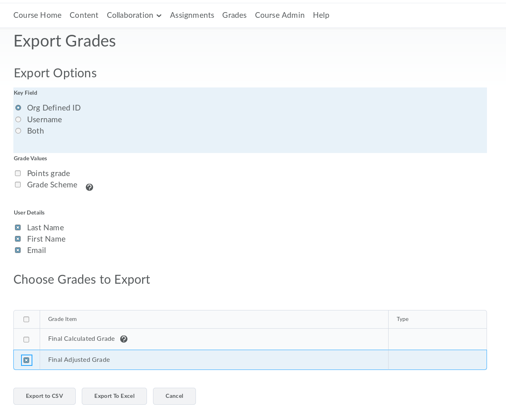
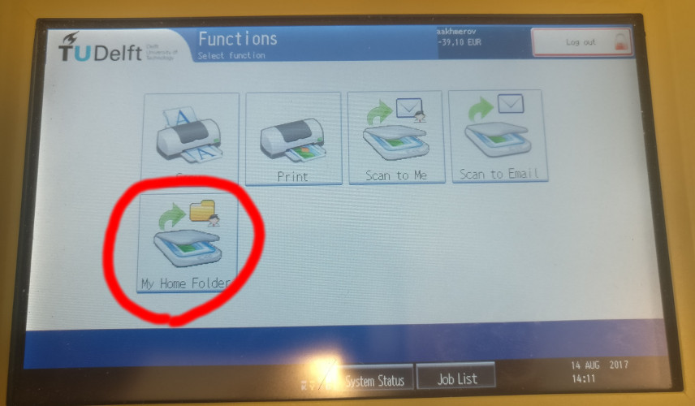
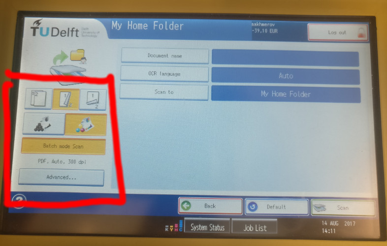
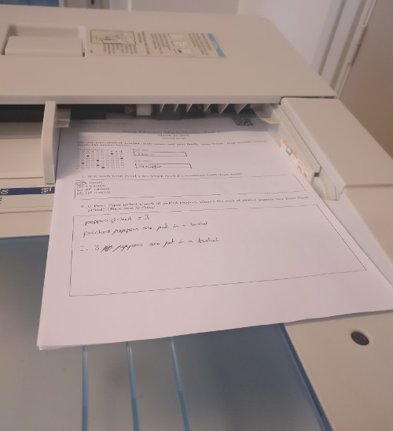

# Welcome to zesje

*Zesje* is an online software for grading exams.

As its name suggests, Zesje has been designed as a **minimal working prototype** during our free time so do not expect any degree of polish. Still it can provide a lot of advantages over manual grading, especially when dealing with large courses.

This notebook is a brief reference of Zesje workflow.

## Limitations and disclaimer

+ **Zesje is a prototype-level software**: it is so far tested by people using it. It is not developed by professional web developers, and it certainly has many rough edges.
+ If something breaks, we are very sorry. Most likely we'd be able to fix your problem, but we do not provide any guarantees.
+ Fully trusted users: anyone with the login and password for your Zesje installation can do anything you can.
+ No change history. When we host Zesje there are daily backups, but it does not come out of the box and you cannot revert your changes manually.
+ The current iteration of Zesje assumes that its users are at TU Delft. If you want to use it for outside courses, it will need to be tweaked. We expect to lift this restriction in the future

## Support

If you want to use zesje in a course, we are happy to host it for you, contact us at [zesje@antonakhmerov.org](mailto:zesje@antonakhmerov.org) or [zesje@weston.cloud](mailto:zesje@weston.cloud).

We also ask you to sign up for the zesje [support mailing list](https://listserv.tudelft.nl/mailman/listinfo/zesje-tnw) (available from TUD network).

If you have questions about using zesje, please use the following channels:
* if you have a question, use the zesje support chat at https://chat.quantumtinkerer.tudelft.nl/external/channels/zesje (you'll need to create an account and join the **external** team after creating it).
* if you found a bug or if you have a suggestion for improvement, please report it at Zesje [issue tracker](https://gitlab.kwant-project.org/zesje/zesje/issues).

## Initializing a course

Each course will need its own zesje installation, but a single installation can be used to grade multiple exams.

### Adding students

1. Export the student information from Brightspace LMS. To do that go to the course page, select *Grades* → *Enter grades* → *Export grades*. Then choose the options as shown:



2. Browse to [students](/students) and upload the resulting `.csv` file.

You can add more students and edit existing student information at any time. It is currently not possible to remove students from Zesje.

### Adding graders

Go to the [graders page](/graders) and add all the names of the graders. Currently zesje considers all the users as trusted, but for the ease of figuring out who graded what, you must tell the app who you are before starting to grade.

## Creating an exam

#### Important warnings:
+ Since every copy of an exam should have a unique copy number, you shouldn't print the same copies twice.
+ Use sufficient space for each answer. If the students do run out of space, they should submit **two complete copies of the exam** (where most problems may be left blank).

### Create the exam in zesje

1. Upload the pdf of your exam at this [URL](/exams) (exam selector → Add new).
2. Check that the student identification widget and the barcode do not overlap with other text.
3. Mark the places where the students are supposed to write their answers in the preview and add problem names.
4. Finalize the exam (do check that everything looks correct!)
5. Prepare multiple exam copies for printing.

Before finalizing an exam you may delete it if you realize that something is wrong.

## Scanning and uploading the solutions

### Find a good scanner

There are two types of scanners in TU Delft: Ricoh Alficio 3001 and Ricoh Alficio 4501. The 4501 model will take several minutes for a large exam, while 3001 lasts more than an hour. Find the 4501 model and use it (there is one in F183 for example).

### Scanner settings

#### Select the "My Home Folder" option:



#### Select the following scanner settings:



#### Use the paper feed, as shown:



### Uploading the scan results

**Note:** it may take up to an hour after the scanning has physically stopped for the scanners to generate a pdf for large exams.

Once it's done, get it from your webdata by any means, for example at `https://webdata.tudelft.nl/staff-homes/<first letter of last name>/<netid>/My Documents/`

Finally select the correct exam and upload the files via the submissions tab.

**Note:** If you reupload scans of the same pages, these will overwrite the older uploads. Therefore you can always fix problems later if your initial upload isn't good enough.

### Verifying the students

Check that the students are identified correctly in the [students](/students) tab. This is necessary to ensure that all the student numbers are identified correctly.

When a student number is identified automatically from the submission, it is highlighted in blue. Click on it or hit enter to confirm the selection; this will change the highlight color to green.

* If the student was not identified correctly, type their name or student number into the search box and hit enter once you find the right student.
* If the student information is incorrect, click on the "pencil" icon next to the student name to edit it.

## Grading an exam

### Assiging grades and feedback
+ Select the feedback options
+ Add any "specific" feedback for a particular solution, but this is for information purposes only, and does not add/subtract points

### Editing the grading scheme
+ Based on the idea that you can student answers tend to have similarities
+ Zesje allows you to adapt your feedback to student responses while grading
+ You don't need to decide on a final grading scheme beforehand

### Choosing a grading scheme

While you are completely free in choosing the grading scheme, and you should choose the workflow that works best for you, there are several things that you may want to follow.

+ **Important**: Zesje uses integers for all scores. Ensure that the smallest amount of score differences is 1 point.
+ Zejse considers solutions graded when at least one feedback is selected. Therefore keep one option with 0 points, and one with the maximal score for the problem.
+ Since the feedback the students see is based on the feedback options you select, for most cases it makes sense to give the students a maximal score and subtract some points for the omissions they made.
+ Choose short and easy to remember names for the feedback options. In the extended description try to outline the part of the solution. The students can see this in an email.

### Updating a specific student

If you need to navigate to a specific student, use the "jump to student" text field. Thanks to auto-completion, it allows you to search a student by name or their student number.

## Processing results

Check the overall results in the [overview](/overview) tab.

Here are some important checks you can perform:

+ The problems that are not completely graded are greyed out; check that the grading is complete.
+ Zesje is not opinionated about the exam design, however we compute two statistical indicators:
  - the Rir coefficient (the correlation between a question and the rest of the questions). If this correlation becomes low or negative, the question is likely random and does not correlate with learner's success.
  - [Cronbach's α](https://en.wikipedia.org/wiki/Cronbach%27s_alpha): the measure of whether the exam checks one or multiple skills. A low value may indicate a need to review the learning goals.
+ Further, for each problem Zesje counts how many time each feedback option was assigned, and shows the points and the detailed description for all of those. Verify that these are understandable, and that the overall grading scheme is reasonable.

## Sending feedback

If you wish to notify the students of their results, you may send [email](/email).

### Prepare an email template

First, you need to prepare the email template. In the [email](/email) tab you see the template edit field with next to it a resulting email shown for the selected student.

The template is written using the [Jinja 2](http://jinja.pocoo.org/docs/2.9/templates/#template-designer-documentation) templating language. This allows you to intermix regular text with special commands that will do things like optionally include some text if a certain condition is satisfied, or print the contents of some variable (such as the student's name or grade).

Although you can find a comprehensive language reference on the Jinja website, we include some basic usage below.

#### Printing variables
Type a variable name inside double curly braces (`{{`) to have the variable printed in the document, e.g.
```
{{ first_name }}
```
expands to the first name of the student that the template is rendering. Variables can also have *attributes*, which can
be accessed with `.` inside a variable expansion, e.g.
```
your grade is: {{ student.total }}
```
Jinja also includes so-called "filters" that can be used to modify the way a variable is printed. For example,
```
{{ student.first_name | uppercase }}
```
will print the student's first name in uppercase. The Jinja website hasa complete list of available filters.

#### Optionally including text
Include optional text between `` and `` tags, e.g.
```
This text is always included

Well done {{student.first_name}}; you did very well.

```

#### Looping
It is possible to loop with the `` `` tags, e.g.
```

  your feedback: {{ feedback.short }}

```

#### List of variables
Within your templates you can use the **`student`** and **`results`** variables. `student` has several attributes, and `results` is a list (that you can use in a `` loop).

##### `student`
+ `first_name`: Student's first name
+ `last_name`: Student's last name
+ `email`: Student's email address
+ `total`: Sum of the `score`s for the student's problems

##### elements of `results`
+ `name`: Problem name
+ `max_score`: Maximum score for the problem
+ `feedback`: List of feedback the student got for this problem. Each
              element has the following attributes:
  - `short`: Short description of the feedback, as used when grading
  - `score`: Score associated with this feedback
  - `description`: Long description of the feedback
+ `score`: Student's score for this problem
+ `remarks`: Student-specific feedback

### Send feedback to indivdual students or everyone

It is a good idea check your template by rendering it for a few students before sending any feedback by email, to make sure that your template is working.

You can now email the rendered template to the currently selected student, optionally specifying a CC, which could be a course instructor.

To send personalized emails to all students, use the *everyone* tab in the email panel. Sending the emails to everyone may take some time, and it is impossible to interrupt this process. That being said, do not browse away, so that you can see if anything goes wrong. You will see an error message if some emails were not sent.

## Exporting data

Finally, in the "export" drop-down menu of the navigation bar you can export the data in several commonly used formats.
